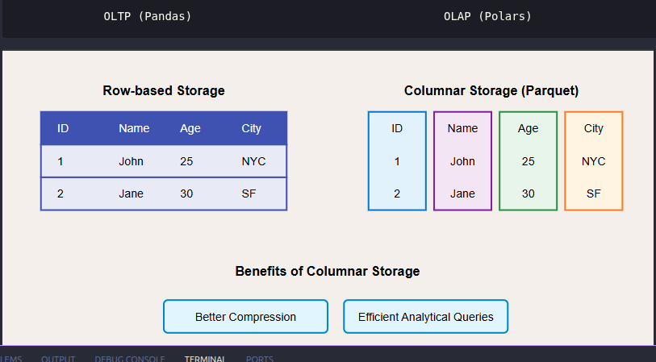

# 💻 Entorno de Trabajo y Rendimiento

## 🖥️ Equipo utilizado

Modelo: Lenovo IdeaPad Gaming 3
Memoria RAM: 16 GB
Sistema operativo: Linux

## ⚙️ Influencia del hardware en el análisis de datos

Contar con 16 GB de RAM permite trabajar de forma fluida con datasets medianos y grandes, evitando errores de memoria y mejorando el rendimiento en procesos ETL.

Además, el procesador del equipo permite aprovechar herramientas modernas como Polars, que utilizan múltiples núcleos para acelerar el procesamiento de datos.

## 🚀 Polars vs Pandas (enfoque OLTP vs OLAP)

### 🧾 OLTP (procesamiento transaccional)

Operaciones rápidas, simples y en tiempo real
Ejemplo: registros individuales, consultas pequeñas

👉 Pandas

Más flexible para análisis pequeños
Ideal para exploración rápida en notebooks
Mejor integración con librerías de visualización

### 📊 OLAP (procesamiento analítico)

Grandes volúmenes de datos
Consultas complejas, agregaciones, transformaciones

👉 Polars

Alto rendimiento en datasets grandes
Procesamiento en paralelo (multi-core)
Menor consumo de memoria
Optimización automática con lazy evaluation

### 🧠 conclusion

Pandas → mejor para análisis exploratorio y escenarios tipo OLTP
Polars → mejor para procesamiento analítico (OLAP) y grandes volúmenes de datos

En esta parte del proyecto se uso mas polars que pandas por el alto volumen de datos aunque algunos datos ssean mas de tipo OLTP pero en la parte de [pruebas de rendimiento](../prubeas-de-rendimiento/) se ve el porque de usar polars en estos casos.