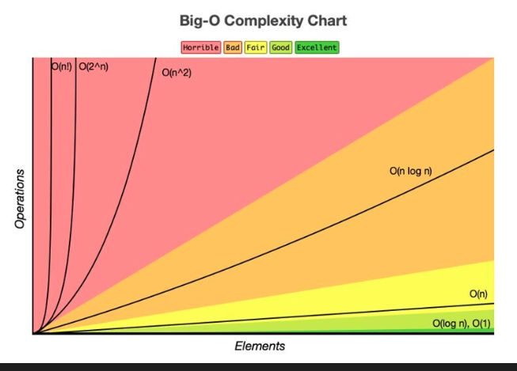

# 📊 Importancia del Análisis de Algoritmos y el Uso de Polars

## 🧠 Introducción

El análisis de algoritmos es una parte fundamental en el desarrollo de software y en el manejo eficiente de datos. Permite entender qué tan rápido y qué tan eficiente es un proceso computacional.

En el contexto del análisis de datos, herramientas como **Polars** permiten aplicar estos conceptos de manera práctica, optimizando el rendimiento y reduciendo tiempos de ejecución.

En este proyecto se muestran la eficiencia de la creacion de polars o tambien de otros algoridmos para realizar buquedas extenas dentro de un gran munero de datso en un archivo csv 

## ejecucion del proyecto
en este caso tenemos 
- cedulas-simuladas1.csv
- cedulas-simuladas2.csv    
estas dos para un ejemplo de integracion en un solo archivo .csv
y el archivo que esta ya integrado llamado **cedulas-simuladas-total.csv** que nos sservira para hacerle el analisis a loss dato o mejor dicho ver la complejidad algoridmica de polars

### si quieren usar los datos completos para obtener resultados mas reales en este drive pueden encontrarlos 
### - [carpeta con los datos](https://drive.google.com/drive/folders/1tuugYsOuOAbYCUeusr2hhc7JakumANPW)
### - los datos se llaman **cedulas-simuladas-total.csv**
---

## ⚙️ ¿Qué es el análisis de algoritmos?

El análisis de algoritmos estudia:

* Tiempo de ejecución
* Uso de memoria
* Escalabilidad

Se basa principalmente en conceptos como:

* Complejidad temporal (O(n), O(log n), O(n²))
* Complejidad espacial

---

## 🚀 ¿Por qué es importante?

### 1. Mejora el rendimiento

Permite elegir soluciones más rápidas y eficientes.

### 2. Escalabilidad

Un buen algoritmo funciona bien incluso con grandes volúmenes de datos.

### 3. Optimización de recursos

Reduce el uso innecesario de memoria y CPU.

### 4. Toma de decisiones

Ayuda a seleccionar la mejor estrategia para procesar datos.

---

## 🔥 ¿Cómo aplica Polars el análisis de algoritmos?

### 1. Ejecución eficiente

Polars optimiza internamente las operaciones usando algoritmos más rápidos.

### 2. Lazy Evaluation (evaluación perezosa)

En lugar de ejecutar cada operación inmediatamente, Polars:

* Construye un plan de ejecución
* Optimiza ese plan
* Ejecuta todo de forma eficiente

Esto reduce costos computacionales.

### 3. Paralelismo

Polars aprovecha múltiples núcleos del CPU:

* Divide tareas
* Ejecuta operaciones en paralelo

Resultado: mayor velocidad.

### 4. Optimización de memoria

* Uso de estructuras compactas
* Evita copias innecesarias

aunque polars sea tan eficiente depende implicitamente de la ram que tengamos disponible entre mas mejor pero esto aveces se puede traducir en las empresas como mas costo operacional mejorando tiempos de optimizaicon pero tambien siendo mas costoso que otras opciones como se denotan en plataformas de gcp a la hora de consultar o guardar datos.
---
